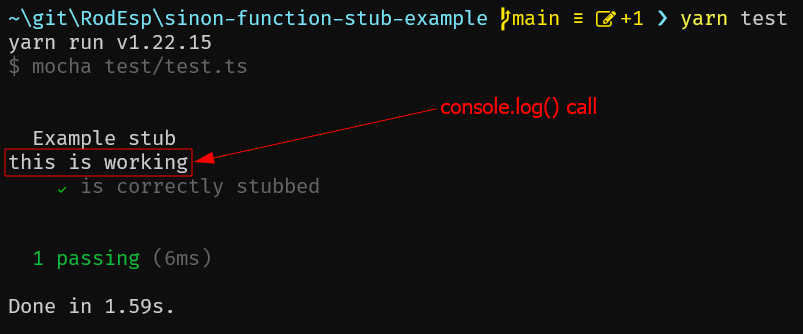

## This repo shows how to stub a function for unit testing with Mocha, Typescript, and Sinon.js.

> Please refer to [test.ts](./test/test.ts) for the example.

## How to run
1. Clone this repo
2. Run `npm install` or `yarn install`
3. Run `npm test` or `yarn test`

## Explanation
[test.ts](./test/test.ts) imports the stubee module using the `as` keyword so that it can then use `sinon.stub()` to stub out the default export.

[test.ts - line 5](./test/test.ts#L5)
```js
import * as stubableFunction from '../src/stubee';
```
[test.ts - line 11](./test/test.ts#L11)
```js
sandbox.stub(stubableFunction, 'default').resolves('this is working');
```

When you run `yarn test` you should see the `console.log()` call in [moduleUnderTest.ts - line 7](./src/moduleUnderTest.ts#L7) output what we told our stub to resolve to and the test passing:
